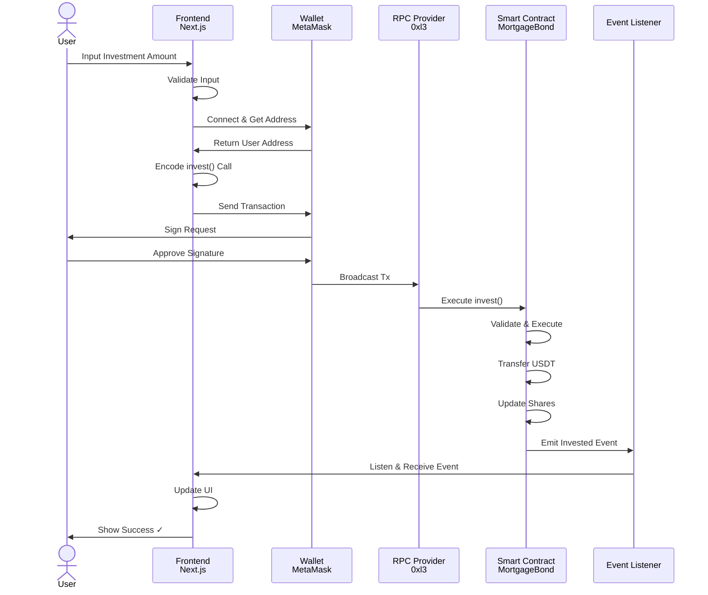
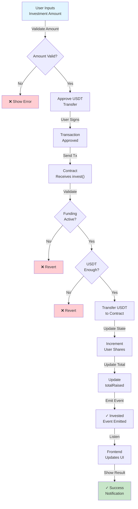
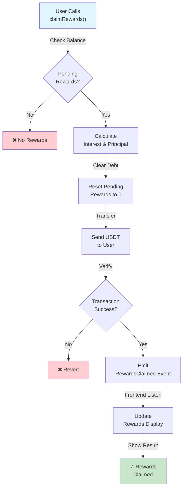
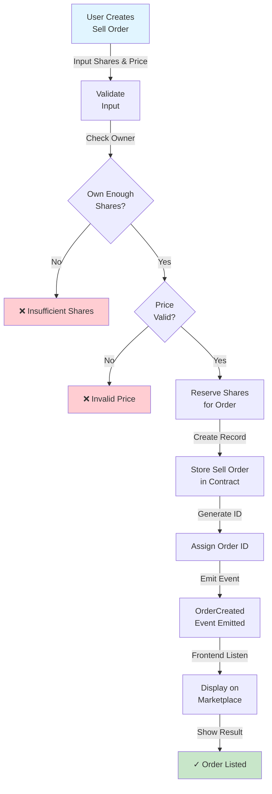
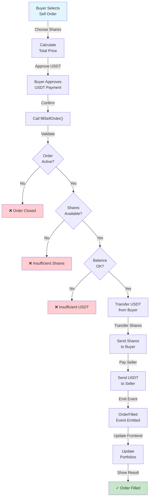
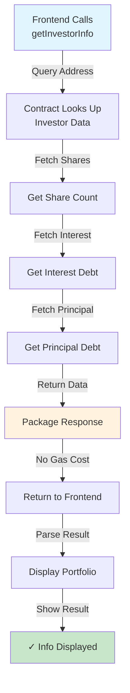

# API Reference & Smart Contract Functions

## Overview

This document provides comprehensive API reference for the mortage-house platform, including all smart contract functions, frontend API endpoints, and integration examples.

## Data Flow: From Frontend to Smart Contract



## Smart Contract API

### MortgageBond Contract

**Address:** `0x...` (deployed)  
**Network:** 0xl3 Network (Chain ID: 1)  
**Token:** USDT (ERC-20)

#### State Variables (Read-Only)

```solidity
// Immutable configuration
uint256 public FUNDING_CAP        // Total funding target (e.g., 1,000,000 USDT)

// Dynamic state
uint256 public totalPrincipalRaised    // Current total investment
bool public isFundingActive            // Is accepting investments
address public issuer                  // Contract creator/admin
IMinimalERC20 public paymentToken      // USDT token interface

// Accumulated values (for pro-rata distribution)
uint256 public accInterestPerShare     // Interest accumulated per share
uint256 public accPrincipalPerShare    // Principal accumulated per share
```

#### Core Functions

##### 1. **invest(uint256 amount)** → WRITE

Investor purchases shares in the mortgage bond.

**User Journey:**
```
User Reviews Property
    ↓
Decides Investment Amount
    ↓
Approves USDT Spend
    ↓
Calls invest() Function
    ↓
Receives Shares
    ↓
Portfolio Updated
```

```solidity
function invest(uint256 amount) external
```

**Parameters:**
- `amount`: Investment amount in USDT (must be > 0, in wei)

**Requirements:**
- Funding must be active (`isFundingActive == true`)
- Total raised + amount must not exceed `FUNDING_CAP`
- Caller must have approved USDT transfer
- Caller must have sufficient USDT balance

**Events Emitted:**
```solidity
event Invested(address indexed user, uint256 amount);
```

**Returns:** `(boolean success)`

**Gas Estimate:** ~100,000 gas

**Flow Diagram:**


**Example (Frontend):**
```typescript
// 1. Setup
const mortgageContract = new ethers.Contract(
  MORTGAGE_ADDRESS,
  MortgageABI,
  signer
);
const usdtContract = new ethers.Contract(
  USDT_ADDRESS,
  ERC20_ABI,
  signer
);

// 2. Approve USDT
const approveTx = await usdtContract.approve(
  MORTGAGE_ADDRESS,
  ethers.parseUnits("1000", 6)  // 1000 USDT
);
await approveTx.wait();

// 3. Invest
const investTx = await mortgageContract.invest(
  ethers.parseUnits("1000", 6)
);
const receipt = await investTx.wait();

// 4. Handle success
console.log("Investment successful:", receipt.transactionHash);
```

---

##### 2. **claimRewards()** → WRITE

Claim accumulated interest and principal distributions.

**User Journey:**
```
Distribution Event Occurs
    ↓
Interest/Principal Distributed
    ↓
User Calls claimRewards()
    ↓
USDT Transferred to Wallet
    ↓
Balance Updated
```

```solidity
function claimRewards() external returns (uint256 interest, uint256 principal)
```

**Requirements:**
- Caller must have pending rewards
- Cannot claim more than available balance

**Events Emitted:**
```solidity
event RewardsClaimed(
  address indexed user,
  uint256 interest,
  uint256 principal
);
```

**Returns:**
- `interest`: Amount of interest claimed (in wei)
- `principal`: Amount of principal claimed (in wei)

**Gas Estimate:** ~80,000 gas

**Flow Diagram:**


**Example (Frontend):**
```typescript
const claimTx = await mortgageContract.claimRewards();
const receipt = await claimTx.wait();

const [interest, principal] = receipt.events
  .find(e => e.event === 'RewardsClaimed')
  .args;

console.log(`Interest: ${ethers.formatUnits(interest, 6)} USDT`);
console.log(`Principal: ${ethers.formatUnits(principal, 6)} USDT`);
```

---

##### 3. **createSellOrder(uint256 shareAmount, uint256 price)** → WRITE

Create secondary market sell order for shares.

**User Journey:**
```
Investor Owns Shares
    ↓
Decides to Sell
    ↓
Sets Price
    ↓
Creates Sell Order
    ↓
Listed on Marketplace
    ↓
Awaits Buyer
```

```solidity
function createSellOrder(
  uint256 shareAmount,
  uint256 price
) external returns (uint256 orderId)
```

**Parameters:**
- `shareAmount`: Number of shares to sell
- `price`: Price per share in USDT (in wei)

**Requirements:**
- Caller must own at least `shareAmount` shares
- Price must be > 0

**Events Emitted:**
```solidity
event OrderCreated(
  uint256 indexed orderId,
  address indexed seller,
  uint256 amount,
  uint256 price
);
```

**Returns:** `orderId` - Unique sell order ID

**Gas Estimate:** ~50,000 gas

**Flow Diagram:**


---

##### 4. **fillSellOrder(uint256 orderId, uint256 shareAmount)** → WRITE

Purchase shares from existing sell order.

**User Journey:**
```
Browse Marketplace
    ↓
Find Attractive Sell Order
    ↓
Approve USDT Payment
    ↓
Execute Purchase
    ↓
Shares Transferred
    ↓
Portfolio Updated
```

```solidity
function fillSellOrder(
  uint256 orderId,
  uint256 shareAmount
) external
```

**Parameters:**
- `orderId`: ID of the sell order
- `shareAmount`: Number of shares to purchase

**Requirements:**
- Order must be active
- Shares available >= requested amount
- Caller must have approved USDT for payment

**Events Emitted:**
```solidity
event OrderFilled(
  uint256 indexed orderId,
  address indexed buyer,
  address indexed seller,
  uint256 amount,
  uint256 price
);
```

**Gas Estimate:** ~120,000 gas

**Flow Diagram:**


---

##### 5. **getInvestorInfo(address investor)** → READ

Get investor's current holdings and pending rewards.

```solidity
function getInvestorInfo(address investor)
  external
  view
  returns (
    uint256 shares,
    uint256 interestDebt,
    uint256 principalDebt
  )
```

**Parameters:**
- `investor`: Address to query

**Returns:**
```solidity
(
  uint256 shares,              // Shares owned
  uint256 interestDebt,        // Pending interest rewards
  uint256 principalDebt        // Pending principal rewards
)
```

**Gas Cost:** ~5,000 gas (view function)

**Flow Diagram:**


**Example (Frontend):**
```typescript
const [shares, interest, principal] = 
  await mortgageContract.getInvestorInfo(userAddress);

console.log(`Shares: ${shares}`);
console.log(`Pending Interest: ${ethers.formatUnits(interest, 6)} USDT`);
console.log(`Pending Principal: ${ethers.formatUnits(principal, 6)} USDT`);
```

---

##### 6. **getSellOrder(uint256 orderId)** → READ

Get sell order details.

```solidity
function getSellOrder(uint256 orderId)
  external
  view
  returns (SellOrder memory)
```

**Returns:**
```solidity
{
  address seller,      // Original share owner
  uint256 shareAmount, // Shares available
  uint256 price,       // Price per share
  bool isActive        // Order active status
}
```

---

##### 7. **distributePrincipal(uint256 amountDeclared)** → WRITE (Admin Only)

Distribute principal repayment to all investors (pro-rata).

**Admin Journey:**
```
Mortgage Payment Received
    ↓
Admin Declares Amount
    ↓
Calls distributePrincipal()
    ↓
Calculates Pro-Rata Per Share
    ↓
Investors Can Claim
```

```solidity
function distributePrincipal(uint256 amountDeclared) external onlyIssuer
```

**Requirements:**
- Caller must be contract issuer
- USDT must be transferred to contract first

**Events Emitted:**
```solidity
event PaymentDistributed(string paymentType, uint256 amountDeclared);
```

---

##### 8. **distributeInterest(uint256 amountDeclared)** → WRITE (Admin Only)

Distribute interest payments to all investors (pro-rata).

```solidity
function distributeInterest(uint256 amountDeclared) external onlyIssuer
```

**Parameters:**
- `amountDeclared`: Total interest amount in wei

---

## Frontend API Endpoints

### Dashboard API

#### GET `/api/mortgage/status`

Get current mortgage contract status.

**Query Parameters:**
- `contractAddress`: Mortgage contract address (optional, uses default if not provided)

**Response:**
```json
{
  "contractAddress": "0x...",
  "fundingCap": "1000000000000",
  "totalRaised": "500000000000",
  "fundingPercentage": 50,
  "isFundingActive": true,
  "accInterestPerShare": "1000000",
  "accPrincipalPerShare": "0"
}
```

---

#### GET `/api/investor/:address`

Get investor portfolio and rewards.

**Parameters:**
- `address`: Investor wallet address

**Response:**
```json
{
  "address": "0x...",
  "shares": "10000",
  "investmentAmount": "10000000000",
  "pendingInterest": "500000000",
  "pendingPrincipal": "0",
  "claimedRewards": {
    "totalInterest": "1000000000",
    "totalPrincipal": "500000000"
  },
  "investments": [
    {
      "transactionHash": "0x...",
      "amount": "1000000000",
      "timestamp": 1702571234,
      "blockNumber": 12345
    }
  ]
}
```

---

#### POST `/api/transaction/create`

Create and execute a transaction.

**Request Body:**
```json
{
  "type": "invest|claim|sell",
  "params": {
    "amount": "1000000000",
    "price": "100000000"
  }
}
```

**Response:**
```json
{
  "transactionHash": "0x...",
  "status": "pending|success|failed",
  "blockNumber": 12345,
  "gasUsed": "95000",
  "timestamp": 1702571234
}
```

---

#### GET `/api/marketplace/orders`

List all active sell orders.

**Query Parameters:**
- `sortBy`: `price|recent|shares` (default: `recent`)
- `limit`: Max results (default: 20)
- `offset`: Pagination offset (default: 0)

**Response:**
```json
{
  "orders": [
    {
      "orderId": "1",
      "seller": "0x...",
      "shareAmount": "100",
      "price": "100000000",
      "totalValue": "10000000000",
      "createdAt": 1702571234,
      "isActive": true
    }
  ],
  "totalCount": 5,
  "hasMore": false
}
```

---

## Integration Examples

### Example 1: Complete Investment Flow

```typescript
import { ethers } from 'ethers';
import { MortgageContractABI } from './abi/MortgageContract';
import { USDTABI } from './abi/USDT';

async function investInMortgage(
  amount: string,  // in USDT (e.g., "1000")
  mortgageAddress: string,
  usdtAddress: string
) {
  // 1. Connect wallet
  const provider = new ethers.BrowserProvider(window.ethereum);
  const signer = await provider.getSigner();
  const userAddress = await signer.getAddress();

  // 2. Initialize contracts
  const mortgageContract = new ethers.Contract(
    mortgageAddress,
    MortgageContractABI,
    signer
  );
  const usdtContract = new ethers.Contract(
    usdtAddress,
    USDTABI,
    signer
  );

  // 3. Convert amount to wei (USDT has 6 decimals)
  const amountInWei = ethers.parseUnits(amount, 6);

  try {
    // 4. Check user balance
    const balance = await usdtContract.balanceOf(userAddress);
    if (balance < amountInWei) {
      throw new Error('Insufficient USDT balance');
    }

    // 5. Approve USDT transfer
    console.log('Approving USDT...');
    const approveTx = await usdtContract.approve(
      mortgageAddress,
      amountInWei
    );
    await approveTx.wait();
    console.log('Approval confirmed');

    // 6. Execute investment
    console.log('Investing...');
    const investTx = await mortgageContract.invest(amountInWei);
    const receipt = await investTx.wait();
    
    console.log('✓ Investment successful!');
    console.log('Tx Hash:', receipt.transactionHash);
    console.log('Block:', receipt.blockNumber);

    return {
      success: true,
      transactionHash: receipt.transactionHash,
      blockNumber: receipt.blockNumber,
    };
  } catch (error) {
    console.error('Investment failed:', error);
    throw error;
  }
}
```

### Example 2: Monitor Rewards

```typescript
async function monitorRewards(
  investorAddress: string,
  mortgageAddress: string,
  mortgageContract: ethers.Contract
) {
  // Set up event listener
  mortgageContract.on(
    'PaymentDistributed',
    async (paymentType, amount) => {
      console.log(`${paymentType} distributed: ${ethers.formatUnits(amount, 6)} USDT`);

      // Get updated investor info
      const [shares, interest, principal] = 
        await mortgageContract.getInvestorInfo(investorAddress);

      console.log('Updated Rewards:');
      console.log(`  Interest: ${ethers.formatUnits(interest, 6)} USDT`);
      console.log(`  Principal: ${ethers.formatUnits(principal, 6)} USDT`);
    }
  );
}
```

### Example 3: Marketplace Order

```typescript
async function createAndFillSellOrder(
  shareAmount: string,
  pricePerShare: string,
  mortgageContract: ethers.Contract,
  usdtContract: ethers.Contract,
  signer: ethers.Signer
) {
  const shares = ethers.parseUnits(shareAmount, 0);
  const price = ethers.parseUnits(pricePerShare, 6);

  // 1. Create sell order
  const createTx = await mortgageContract.createSellOrder(shares, price);
  const createReceipt = await createTx.wait();
  const orderId = createReceipt.events[0].args.orderId;

  console.log('Sell order created:', orderId);

  // 2. Approve USDT for buyer (as another account)
  const totalPrice = shares * price / (10n ** 0n);
  await usdtContract.approve(mortgageContract.address, totalPrice);

  // 3. Fill order
  const fillTx = await mortgageContract.fillSellOrder(orderId, shares);
  const fillReceipt = await fillTx.wait();

  console.log('✓ Order filled!');
  console.log('Seller received:', ethers.formatUnits(totalPrice, 6), 'USDT');
}
```

## Error Handling

### Common Error Codes & Solutions

```typescript
const errorMap = {
  'revert FundingNotActive': 'Funding period has ended',
  'revert ExceedsFundingCap': 'Investment exceeds funding cap',
  'revert InsufficientApproval': 'USDT approval too low',
  'revert InsufficientBalance': 'Not enough USDT in wallet',
  'revert OrderInactive': 'Sell order no longer available',
};
```

---

**Last Updated:** December 14, 2025  
**Version:** 1.0
