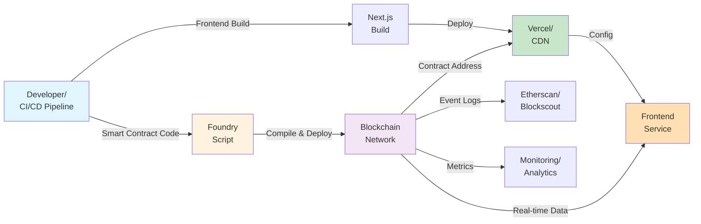

# Deployment Guide

## Overview

This guide covers deployment procedures for the mortage-house platform across different networks: testnet, staging, and mainnet.

## Data Flow & Deployment Architecture



## Pre-Deployment Checklist

### Smart Contract

- [ ] All tests passing (`forge test` - 100% pass rate)
- [ ] Gas optimization reviewed (`forge test --gas-report`)
- [ ] Security audit completed (OpenZeppelin best practices)
- [ ] Contract state variables properly initialized
- [ ] Events properly emitted for all state changes
- [ ] Access control (onlyOwner) correctly implemented
- [ ] Reentrancy guards in place (if applicable)

### Frontend

- [ ] Build succeeds without warnings (`pnpm build`)
- [ ] Environment variables configured correctly
- [ ] Contract addresses updated in `.env.local`
- [ ] All tests passing (`pnpm test`)
- [ ] No console errors in production build
- [ ] Mobile responsiveness verified

### Security & Compliance

- [ ] Private keys secured (never committed)
- [ ] Rate limiting configured
- [ ] CORS properly restricted
- [ ] Input validation on all user inputs
- [ ] Error messages don't expose sensitive data

## Network Configuration

```
┌─────────────────────────────────────────────────────────────┐
│              NETWORK DEPLOYMENT TARGETS                     │
├─────────────────────────────────────────────────────────────┤
│ Network    │ Chain ID │ RPC URL                │ Status   │
├─────────────────────────────────────────────────────────────┤
│ 0xl3       │ 1        │ https://rpc.0xl3.com  │ Active   │
│ Anvil      │ 31337    │ http://localhost:8545 │ Dev      │
│ Polygon    │ 137      │ https://polygon-rpc   │ Future   │
│ Mainnet    │ 1        │ Alchemy/Infura RPC    │ Future   │
└─────────────────────────────────────────────────────────────┘
```

## Deployment Procedures

### 1. Testnet Deployment (0xl3)

#### Smart Contract Deployment

```bash
cd contracts

# Compile contracts
forge build

# Run tests
forge test

# Get your deployer account details
cast account <DEPLOYER_ADDRESS>

# Deploy contract
forge script script/DeployMortgageContract.s.sol \
  --rpc-url https://rpc.0xl3.com \
  --account dev1-deployer \
  --broadcast \
  --verify
```

#### Capture Deployment Output

```bash
# Save the contract address
MORTGAGE_CONTRACT_ADDRESS=$(cast call --rpc-url https://rpc.0xl3.com \
  -e <DEPLOYMENT_HASH> | grep "contractAddress")

# Verify contract on explorer
echo "Verify at: https://0xl3-explorer.com/address/$MORTGAGE_CONTRACT_ADDRESS"
```

#### Frontend Deployment

```bash
cd frontend

# Update .env.local with new contract address
echo "NEXT_PUBLIC_MORTGAGE_CONTRACT=$MORTGAGE_CONTRACT_ADDRESS" >> .env.local

# Build frontend
pnpm build

# Deploy to Vercel
vercel --prod
```

### 2. Staging Deployment (Internal Testing)

```bash
# Create staging branch
git checkout -b staging/v1.0.0

# Deploy contracts to testnet
cd contracts
forge script script/DeployMortgageContract.s.sol \
  --rpc-url https://rpc.0xl3.com \
  --account staging-deployer \
  --broadcast

# Deploy frontend to staging environment
cd ../frontend
NEXT_PUBLIC_ENV=staging pnpm build
vercel --env staging
```

### 3. Mainnet Deployment (Production)

⚠️ **CRITICAL STEPS - REQUIRES MULTI-SIG OR TEAM APPROVAL**

```bash
# Step 1: Final Security Audit
cd contracts
forge test --gas-report

# Step 2: Create deployment tag
git tag v1.0.0-production
git push origin v1.0.0-production

# Step 3: Smart Contract Deployment
forge script script/DeployMortgageContract.s.sol \
  --rpc-url https://mainnet-rpc.com \
  --account mainnet-deployer \
  --broadcast \
  --verify \
  --slow  # Use slow transactions for mainnet

# Step 4: Verify Contract
forge verify-contract <CONTRACT_ADDRESS> \
  src/MortgageContract.sol:MortgageBond \
  --chain-id 1 \
  --constructor-args $(cast abi-encode "constructor(address,uint256)" \
    "0xdac17f958d2ee523a2206206994597c13d831ec7" "1000000000000")

# Step 5: Frontend Deployment
cd ../frontend
NEXT_PUBLIC_ENV=production pnpm build
vercel --prod
```

## Post-Deployment Verification

### Contract Verification Checklist

```bash
# Check contract code
cast code <CONTRACT_ADDRESS> --rpc-url <RPC_URL>

# Verify initial state
cast call <CONTRACT_ADDRESS> "FUNDING_CAP()" --rpc-url <RPC_URL>
cast call <CONTRACT_ADDRESS> "issuer()" --rpc-url <RPC_URL>

# Verify USDT integration
cast call <CONTRACT_ADDRESS> "paymentToken()" --rpc-url <RPC_URL>

# Monitor events
cast logs --from-block 0 --rpc-url <RPC_URL> \
  --address <CONTRACT_ADDRESS> "Invested(address,uint256)"
```

### Frontend Health Checks

```bash
# Check API endpoint
curl https://your-domain.com/api/health

# Verify contract connection
# Open browser DevTools and check Network tab for contract calls

# Monitor error rates
# Check Sentry/LogRocket dashboard for JS errors
```

## Rollback Procedures

### If Contract Deployment Fails

```bash
# 1. Stop deployment immediately
# 2. Analyze error logs

forge script script/DeployMortgageContract.s.sol \
  --rpc-url https://rpc.0xl3.com \
  --account dev1-deployer \
  --resume  # Resume from last checkpoint

# 3. If resume fails, deploy new instance with different parameters
```

### If Frontend Deployment Fails

```bash
# Revert to previous Vercel deployment
vercel rollback

# Or redeploy from previous commit
git revert HEAD
pnpm build
vercel --prod
```

## Monitoring & Maintenance

### Real-Time Monitoring

```
┌─────────────────────────────────────────────────────┐
│         MONITORING DASHBOARD SETUP                  │
├─────────────────────────────────────────────────────┤
│ • Contract Events: Etherscan Event Logs             │
│ • Frontend Health: Sentry Error Tracking            │
│ • Gas Costs: eth-gas-station API                    │
│ • User Activity: Mixpanel/PostHog Analytics        │
│ • Transaction Status: The Graph (Subgraph)         │
└─────────────────────────────────────────────────────┘
```

### Key Metrics to Monitor

| Metric | Target | Alert Threshold |
|--------|--------|-----------------|
| Contract Deployment | < 5 min | > 10 min |
| Transaction Success Rate | > 99% | < 95% |
| Frontend Load Time | < 3s | > 5s |
| Gas Usage per Invest | < 100k | > 150k |
| Error Rate | < 0.1% | > 1% |

## Troubleshooting Deployment Issues

### Common Issues

| Issue | Cause | Solution |
|-------|-------|----------|
| `OutOfGas` error | Insufficient gas limit | Increase `gasLimit` in deploy script |
| Contract verification fails | Source code mismatch | Ensure compiler version matches |
| Frontend can't connect to contract | Wrong contract address in `.env` | Update contract address in frontend config |
| RPC timeout | Network congestion | Use different RPC provider or retry |

## CI/CD Integration

### GitHub Actions Workflow

Create `.github/workflows/deploy.yml`:

```yaml
name: Deploy

on:
  push:
    branches: [main, staging]
  pull_request:
    branches: [main]

jobs:
  test-and-deploy:
    runs-on: ubuntu-latest
    steps:
      - uses: actions/checkout@v3
      - uses: foundry-rs/foundry-toolchain@v1
      - name: Run tests
        run: cd contracts && forge test
      - name: Deploy (if main branch)
        if: github.ref == 'refs/heads/main'
        run: |
          cd contracts
          forge script script/DeployMortgageContract.s.sol \
            --rpc-url ${{ secrets.RPC_URL }} \
            --private-key ${{ secrets.DEPLOYER_KEY }} \
            --broadcast
```

## Emergency Procedures

### Contract Pause/Upgrade

```bash
# If critical vulnerability discovered:
# 1. Call emergency pause function (if implemented)
forge call <CONTRACT_ADDRESS> "pause()" \
  --rpc-url <RPC_URL> \
  --account admin

# 2. Notify all stakeholders
# 3. Plan upgrade deployment
```

## Next Steps

- Monitor [MONITORING.md](./MONITORING.md) for production health checks
- Review [TROUBLESHOOTING.md](./TROUBLESHOOTING.md) for common issues
- Check [SECURITY.md](./SECURITY.md) for security best practices

---

**Last Updated:** December 14, 2025  
**Version:** 1.0
