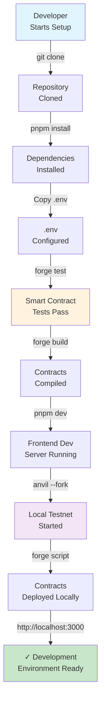

# Development Setup Guide

## Overview

This guide provides step-by-step instructions for setting up your local development environment for the mortage-house platform, including both smart contracts and the frontend application.

## Prerequisites

- Node.js >= 18.x
- pnpm >= 8.x
- Foundry/Forge (for Solidity development)
- Git
- macOS/Linux (Windows with WSL recommended)

## User Journey Diagram



## Step-by-Step Setup

### 1. Clone Repository

```bash
git clone https://github.com/tokenine/mortgage-house.git
cd mortgage-house
```

### 2. Install Dependencies

```bash
# Install all workspace dependencies
pnpm install

# Navigate to contracts directory for Foundry setup
cd contracts
forge install
```

### 3. Environment Configuration

#### Contracts (.env)

Create `.env` file in `contracts/` directory:

```bash
# RPC Configuration
RPC_MAINNET=https://eth-mainnet.g.alchemy.com/v2/YOUR_KEY
RPC_TESTNET=https://rpc.0xl3.com

# Account Configuration
DEPLOYER_PRIVATE_KEY=your_key_here
DEV1_PRIVATE_KEY=your_dev_key

# Contract Configuration
USDT_ADDRESS=0xdac17f958d2ee523a2206206994597c13d831ec7
FUNDING_CAP=1000000000000  # 1M USDT
```

#### Frontend (.env.local)

Create `.env.local` file in `frontend/` directory:

```bash
# RPC Configuration
NEXT_PUBLIC_RPC_URL=https://rpc.0xl3.com
NEXT_PUBLIC_CHAIN_ID=1

# Contract Configuration
NEXT_PUBLIC_MORTGAGE_CONTRACT=0x...
NEXT_PUBLIC_USDT_ADDRESS=0xdac17f958d2ee523a2206206994597c13d831ec7

# External Services
NEXT_PUBLIC_ETHERSCAN_API_KEY=your_key
```

### 4. Smart Contract Setup

```bash
cd contracts

# Compile contracts
forge build

# Run test suite
forge test

# Run specific test
forge test --match-contract MortgageContractTest

# Run tests with gas report
forge test --gas-report
```

### 5. Frontend Setup

```bash
cd frontend

# Install dependencies
pnpm install

# Start development server
pnpm dev

# Open http://localhost:3000
```

### 6. Local Testnet Deployment

#### Option A: Using Anvil (Foundry)

```bash
# Terminal 1: Start Anvil
anvil --fork-url https://rpc.0xl3.com

# Terminal 2: Deploy to Anvil
cd contracts
forge script script/DeployMortgageContract.s.sol \
  --rpc-url http://localhost:8545 \
  --private-key $DEPLOYER_PRIVATE_KEY \
  --broadcast
```

#### Option B: Using Hardhat

```bash
cd contracts
npx hardhat node
npx hardhat run scripts/deploy.js --network localhost
```

## Verification

### Smart Contracts

```bash
cd contracts

# Check compilation
forge build --sizes

# Verify contract on testnet
forge verify-contract ADDRESS_HERE src/MortgageContract.sol:MortgageBond \
  --chain-id 1 \
  --constructor-args "encoded_args_here"
```

### Frontend

Open browser and verify:
- [ ] Dashboard loads correctly
- [ ] Wallet connection works
- [ ] Contract state visible on dashboard
- [ ] Console has no errors

## Common Issues & Solutions

| Issue | Solution |
|-------|----------|
| `forge not found` | Run `curl -L https://foundry.paradigm.xyz \| bash && source ~/.bashrc` |
| `pnpm not found` | Run `npm install -g pnpm` |
| RPC connection fails | Check `.env` RPC URL and network connectivity |
| Contract deployment fails | Verify account has sufficient balance and gas |
| Frontend won't connect | Confirm contract address in `.env.local` matches deployed address |

## Development Workflow

```bash
# Create feature branch
git checkout -b feature/your-feature

# Make changes and test
forge test                          # Smart contracts
pnpm dev                           # Frontend

# Commit changes
git add .
git commit -m "feat: your feature"
git push origin feature/your-feature

# Create Pull Request on GitHub
```

## Next Steps

- Review [DEPLOYMENT.md](./DEPLOYMENT.md) for production deployment
- Check [TESTING.md](./TESTING.md) for testing strategies
- See [CONTRIBUTING.md](./CONTRIBUTING.md) for code standards

## Support

For setup issues:
1. Check [TROUBLESHOOTING.md](./TROUBLESHOOTING.md)
2. Review GitHub Issues
3. Contact the development team

---

**Last Updated:** December 14, 2025  
**Version:** 1.0
