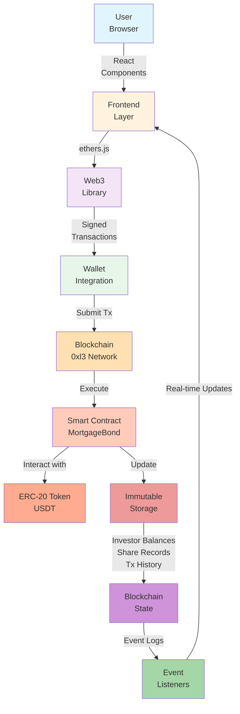

# Glossary & Domain Terminology

## Project-Specific Terms

### Mortgage Bond
The smart contract that represents a single property mortgage investment vehicle. Each property has its own MortgageBond contract managing the complete funding and distribution lifecycle.

### Fractional Investment
Dividing mortgage funding into multiple tradeable shares (1 USDT = 1 share), allowing retail investors to participate with minimum capital.

### Pro-Rata Distribution
Distributing interest and principal payments proportionally based on each investor's share ownership. If you own 10% of shares, you receive 10% of distributions.

### Funding Cap
The maximum total amount (in USDT) that can be raised for a specific property mortgage. Once reached, no more investments are accepted.

### Funding Period
The active period when a mortgage bond accepts new investments. Controlled by the `isFundingActive` boolean.

### Investor
An account that owns shares in one or more mortgage bonds and receives pro-rata distributions.

### Issuer
The contract creator/admin who controls distribution payments and contract operations (typically the lender or property owner).

### Accumulated Distribution (accInterestPerShare, accPrincipalPerShare)
The total interest/principal amount distributed per share since contract creation. Used to calculate claimable rewards.

### Secondary Market
The marketplace feature allowing investors to trade shares with each other through sell orders at self-determined prices.

---

## Blockchain Terms

### Smart Contract
Self-executing code on the blockchain that enforces terms without intermediaries. All contract logic is transparent and immutable.

**Example in mortage-house:**
```solidity
contract MortgageBond {
    // Code that executes when conditions are met
    // All state changes are recorded on blockchain
}
```

### Gas
The computational cost to execute transactions on the blockchain. Measured in gwei (billionths of ETH). Higher complexity = higher gas cost.

**Gas costs in mortage-house:**
- invest: ~95,000 gas
- claimRewards: ~80,000 gas
- createSellOrder: ~50,000 gas

### Transaction
An instruction sent to the blockchain that changes state (write operation) or reads state (read operation). Transactions cost gas and take time to confirm.

**Flow:**
```
User Signs → Wallet → Network → Validators → Confirmed → State Updated
  1 sec      1 sec    1 sec     5-15 sec    5-30 sec    Immediate
```

### Block
A batch of transactions grouped together and added to the blockchain every 12-15 seconds. Each block has a unique number and hash.

### Wallet
Software/hardware that manages private keys (passwords) and enables transaction signing. Examples: MetaMask, WalletConnect, Hardware wallets.

### Address
A 42-character identifier (starting with 0x) representing a unique account on the blockchain.

**Example:** `0x742d35Cc6634C0532925a3b844Bc0e7595f42A1d`

### ABI (Application Binary Interface)
Specification of how to call smart contract functions. Defines function names, parameters, and return types.

**Example:**
```json
[
  {
    "name": "invest",
    "type": "function",
    "inputs": [{ "name": "amount", "type": "uint256" }],
    "outputs": []
  }
]
```

### Event
A signal that something happened in the smart contract. Events are logged and can be listened to by the frontend.

**Example in mortage-house:**
```solidity
event Invested(address indexed user, uint256 amount);
// Emitted when user invests
```

### State
The current data stored in the smart contract (balances, shares, etc.). State changes are permanent and verifiable.

**Example:**
```solidity
uint256 public totalPrincipalRaised = 500000000000;  // Current state
```

### RPC (Remote Procedure Call)
A service that allows you to read from and write to the blockchain without running a full node. Examples: Alchemy, Infura, QuickNode.

**What it does:**
```
Frontend → RPC Provider → Blockchain
Request     Process      Response
```

### ERC-20
The standard for fungible tokens on Ethereum. USDT is an ERC-20 token, following these standardized functions.

**Core functions:**
- `transfer(to, amount)` - Send tokens
- `approve(spender, amount)` - Allow spender to use tokens
- `transferFrom(from, to, amount)` - Transfer on behalf of someone

---

## Technical Architecture Terms

### Frontend
The user interface layer (React/Next.js) that users interact with. Handles wallet connection, user input, and transaction execution.

**Technology Stack:**
- React - UI components
- TypeScript - Type safety
- ethers.js - Blockchain interaction
- Wagmi - Web3 hooks

### Backend/Smart Contracts
The business logic layer (Solidity) that enforces rules and manages state on the blockchain.

**Technology Stack:**
- Solidity - Smart contract language
- Foundry - Development framework
- OpenZeppelin - Security libraries

### Data Flow



---

## Financial Terms

### Principal
The original amount borrowed/invested. When a borrower makes principal payments, they're paying back the original loan amount.

**In mortage-house:**
```
Initial Investment (Principal) = 10,000 USDT
┌─────────────────────────┐
│ Investor owns shares    │
│ Receives pro-rata       │
│ principal repayment     │
└─────────────────────────┘
```

### Interest
The cost of borrowing money, expressed as a percentage. Lenders distribute interest to investors as a return on investment.

**Example:**
```
Mortgage: 1,000,000 USDT at 5% annual interest
Investor owns: 10 shares (1% = 10,000 USDT)
Annual interest payment: 50,000 USDT
Investor receives: 500 USDT
```

### Share
A unit of ownership in a mortgage bond. Each USDT invested equals 1 share.

**Pro-rata calculation:**
```
Your Shares / Total Shares = Your % Ownership
Distribution Amount × Your % = Your Reward
```

### Yield
The return on investment expressed as a percentage. Higher yield means better returns but often higher risk.

**Example:**
```
Investment: 10,000 USDT
Annual Rewards: 500 USDT
Yield: 5%
```

### Liquidity
How quickly an asset can be converted to cash. mortage-house provides liquidity through the secondary marketplace.

---

## Legal/Compliance Terms

### Smart Contract Risk Disclaimer
Investors should understand:
- Code is final and immutable (no FDIC protection)
- Contract bugs could result in permanent loss
- Blockchain transactions are irreversible
- Issuer controls distribution timing

### Hybrid Model
mortage-house combines:
- Off-chain: Legal contracts, KYC verification, property documentation
- On-chain: Transparent transactions, automated distributions, audit trail

### Regulatory Compliance
Follows applicable laws regarding:
- Securities regulations (investment offerings)
- AML/KYC requirements (identity verification)
- Tax reporting (transaction documentation)

---

## Development Terms

### Fork
A copy of the blockchain's history used for testing, so changes don't affect the real network.

```bash
# Create a local fork of 0xl3 network
anvil --fork-url https://rpc.0xl3.com
```

### Test Coverage
The percentage of code that has test cases. Target: >= 90% line coverage.

```bash
forge coverage  # Shows percentage of code tested
```

### Gas Optimization
Making smart contract code more efficient (uses less gas) without changing functionality.

**Goal:** Every function under its gas budget:
- invest: < 100,000 gas
- claimRewards: < 90,000 gas
- createSellOrder: < 60,000 gas

### CI/CD (Continuous Integration/Continuous Deployment)
Automated testing and deployment:
- Push code → Run tests → Deploy if passing
- No manual deployment needed

---

## Common Abbreviations

| Abbreviation | Meaning | Context |
|---|---|---|
| TX/Txn | Transaction | "Your TX hash is 0x..." |
| RPC | Remote Procedure Call | "Configure your RPC URL" |
| ABI | Application Binary Interface | "Load the contract ABI" |
| ERC | Ethereum Request for Comments | "ERC-20 is the token standard" |
| USDT | Tether USD | "The stable coin used" |
| DAPP | Decentralized Application | "mortage-house is a DApp" |
| DEFI | Decentralized Finance | "DeFi protocols are trustless" |
| KYC | Know Your Customer | "KYC verification required" |
| AML | Anti-Money Laundering | "AML compliance checked" |
| GAS | Computational cost | "Gas price is high now" |
| ETH | Ethereum unit | "Costs 0.001 ETH to deploy" |
| GWEI | Gigawei (10^9 wei) | "Gas price: 50 GWEI" |

---

**Last Updated:** December 14, 2025  
**Version:** 1.0
