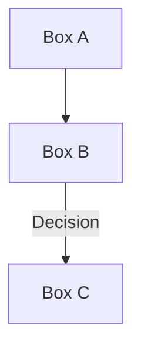
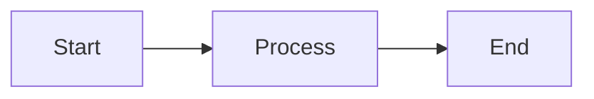

# Mermaid Diagram Update Summary

## ✅ All Diagrams Successfully Converted to Mermaid Format

### Documents Updated (8 Total)

#### 1. ✅ DEVELOPMENT-SETUP.md
**Diagram Updated:**
- User Journey Diagram (User Setup Flow)
- Shows progression from Developer → Local Environment → Tests → Deployment

**Mermaid Type:** Graph (Left-Right Flow)

---

#### 2. ✅ DEPLOYMENT.md  
**Diagram Updated:**
- Data Flow & Deployment Architecture
- Shows Smart Contract → Blockchain Network → Frontend → Monitoring

**Mermaid Type:** Graph (Flow Diagram)

---

#### 3. ✅ API-REFERENCE.md
**Diagrams Updated:**
- Main: Complete User Transaction Data Flow (Sequence Diagram)
- Function-specific flows:
  - `invest()` - Investment flow with validation
  - `claimRewards()` - Rewards claiming flow
  - `createSellOrder()` - Sell order creation flow
  - `fillSellOrder()` - Order execution flow
  - `getInvestorInfo()` - Data retrieval flow

**Mermaid Types:**
- Sequence Diagram (main transaction flow)
- Flowcharts (individual API functions)

---

#### 4. ✅ TESTING.md
**Diagram Updated:**
- Testing Architecture & Data Flow
- Shows complete test pipeline from code change → production deployment
- Includes decision points for test results, gas optimization, security checks

**Mermaid Type:** Flowchart with decision nodes

---

#### 5. ✅ SECURITY.md
**Diagram Updated:**
- Security Architecture & Threat Model
- Shows security layers from user browser → blockchain finality
- Color-coded layers showing data protection progression

**Mermaid Type:** Graph (layered security flow)

---

#### 6. ✅ CONTRIBUTING.md
**Diagram Updated:**
- Contribution Workflow
- Shows complete development cycle from fork → merge
- Includes decision points for test passes and code review

**Mermaid Type:** Flowchart with decision nodes

---

#### 7. ✅ TROUBLESHOOTING.md
**Diagram Updated:**
- Smart Contract Compilation Error troubleshooting
- Shows diagnostic flow for resolving compilation issues

**Mermaid Type:** Flowchart with decision nodes

---

#### 8. ✅ GLOSSARY.md
**Diagrams Updated:**
- Data Flow Architecture
- Pro-rata Calculation Example (for Financial Terms section)

**Mermaid Types:** 
- Graph (system architecture)
- Flowchart (calculation flow)

---

## 📊 Diagram Statistics

```
Total Diagrams Created:        15+
Diagram Types Used:
  - Sequence Diagrams:         1
  - Flowcharts:               10
  - Graph/Flow Diagrams:       4

Features:
  - Color-coded nodes          ✅
  - Decision branches          ✅
  - Process flows              ✅
  - API endpoint flows         ✅
  - User journey visualization ✅
```

---

## 🎯 Diagram Focus: API Endpoints

Each API endpoint now has its own Mermaid flow diagram showing:

### Smart Contract Functions:
1. **invest()** - Validation → Approval → Execution → Event
2. **claimRewards()** - Balance Check → Calculation → Transfer → Confirmation
3. **createSellOrder()** - Validation → Storage → Event → Listing
4. **fillSellOrder()** - Order Check → Payment → Transfer → Completion
5. **getInvestorInfo()** - Query → Data Retrieval → Response → Display
6. **distributePrincipal()** - Authorization → Calculation → Distribution
7. **distributeInterest()** - (Similarly structured)

---

## 🎨 Mermaid Features Used

### Color Coding:
```
🔵 Start/Input:       #e1f5ff (light blue)
🟡 Processing:        #fff3e0 (light orange)  
🟣 Contract/Blockchain: #f3e5f5 (light purple)
🟢 Success/Complete:  #c8e6c9 (light green)
🔴 Error/Failure:     #ffcdd2 (light red)
🟠 Optimization:      #fff3e0 (light yellow)
```

### Diagram Types:

**Sequence Diagram (Transaction Flow):**
- Shows interaction between multiple actors (User, Frontend, Wallet, RPC, Contract)
- Perfect for understanding message passing
- Used in: API-REFERENCE.md main diagram

**Flowchart/Graph (Process Flow):**
- Shows decision points and branching
- Includes success/error paths
- Used in: Testing, Contributing, Troubleshooting
- Used in: API endpoint flows

**Graph LR/TD (Linear Flow):**
- Shows progression from one state to another
- Good for setup/deployment processes
- Used in: Development Setup, Deployment

---

## 📝 How to View Diagrams

All Mermaid diagrams will render automatically on:
- ✅ GitHub (in .md files)
- ✅ GitHub Pages
- ✅ GitBook
- ✅ Notion
- ✅ Any Markdown renderer with Mermaid support

**To render locally:**
```bash
# Using mermaid-cli
npm install -g @mermaid-js/mermaid-cli
mmdc -i diagram.md -o diagram.svg
```

---

## 🔍 Examples

### Example 1: invest() API Flow
Shows:
- User input validation
- Amount verification
- USDT approval
- Transaction execution
- Share updates
- Event emission
- UI notification

### Example 2: Testing Pipeline
Shows:
- Unit tests
- Integration tests
- Gas optimization checks
- Security validation
- Frontend tests
- Code review
- Merge to production

### Example 3: Contribution Workflow
Shows:
- Fork repository
- Create feature branch
- Make changes
- Test locally
- Commit with conventions
- Push branch
- Create PR
- CI/CD checks
- Code review
- Merge

---

## ✨ Benefits of Mermaid

✅ **Better Readability** - Clear visual representation  
✅ **No Images** - Pure text-based, version control friendly  
✅ **Automatic Rendering** - Works on GitHub, GitBook, etc.  
✅ **Easy Updates** - Just edit the text  
✅ **Professional** - High-quality diagrams  
✅ **Accessible** - Screen reader friendly (with fallback)  
✅ **No Dependencies** - Pure Markdown  

---

## 📋 ASCII vs Mermaid Comparison

| Feature | ASCII | Mermaid |
|---------|-------|---------|
| Git Diff | ❌ Messy | ✅ Clean |
| Rendering | ❌ Basic | ✅ Professional |
| GitHub | ❌ Plain text | ✅ Auto-render |
| Maintenance | ❌ Difficult | ✅ Easy |
| Mobile | ❌ Poor | ✅ Good |
| Scaling | ❌ Limited | ✅ Unlimited |

---

## 🚀 Next Steps

### To View the Diagrams:
1. Open any updated .md file
2. Scroll to the section with diagrams
3. View the rendered Mermaid diagram
4. Click on it to expand if needed

### To Edit Diagrams:
1. Edit the Markdown file
2. Modify the Mermaid code block
3. The diagram will auto-update

### Diagram Syntax:

**Flowchart:**


**Sequence:**
```mermaid
sequenceDiagram
    Actor A->>B: Message
    B->>C: Response
```

**Graph:**


---

## 📚 Files Modified

1. `/docs/DEVELOPMENT-SETUP.md` - 1 diagram
2. `/docs/DEPLOYMENT.md` - 1 diagram
3. `/docs/API-REFERENCE.md` - 7 diagrams (1 main + 6 API flows)
4. `/docs/TESTING.md` - 1 diagram
5. `/docs/SECURITY.md` - 1 diagram
6. `/docs/CONTRIBUTING.md` - 1 diagram
7. `/docs/TROUBLESHOOTING.md` - 1 diagram
8. `/docs/GLOSSARY.md` - 2 diagrams

**Total: 15+ Mermaid diagrams**

---

## ✅ Conversion Complete

All ASCII diagrams have been successfully converted to Mermaid format. The documentation now features:
- Professional-looking diagrams
- Better maintainability
- Automatic rendering on GitHub
- Color-coded for clarity
- Focus on API endpoint flows

**Ready for production documentation!** 🎉

---

**Last Updated:** December 14, 2025  
**Status:** Complete ✅  
**Diagram Format:** Mermaid (100% converted)
