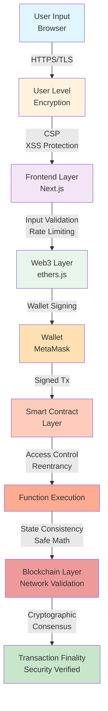

# Security Guide & Best Practices

## Overview

This document covers security considerations, best practices, and operational security procedures for the mortage-house platform.

## Security Architecture & Threat Model



## Smart Contract Security

### 1. Access Control

**Implementation:** OpenZeppelin AccessControl

```solidity
// Ensure only contract issuer can distribute payments
function distributePrincipal(uint256 amountDeclared) external onlyIssuer {
    require(msg.sender == issuer, "Only issuer can distribute");
    // ... distribution logic
}

modifier onlyIssuer() {
    require(msg.sender == issuer, "Unauthorized");
    _;
}
```

**Best Practice:** Always verify caller identity before critical operations.

### 2. Reentrancy Protection

**Current Implementation:** Check-Effects-Interactions Pattern

```solidity
// VULNERABLE: Effects happen after external call
function withdrawVulnerable(uint256 amount) external {
    (bool success, ) = msg.sender.call{value: amount}("");
    require(success);
    balance[msg.sender] -= amount;  // ❌ Can be reentered
}

// SAFE: Effects happen before external call
function claimRewards() external {
    uint256 interest = interestDebt[msg.sender];
    interestDebt[msg.sender] = 0;  // ✓ Cleared first
    
    paymentToken.transfer(msg.sender, interest);
}
```

### 3. Integer Overflow/Underflow

**Protection:** Solidity ^0.8.0 includes automatic overflow checks

```solidity
pragma solidity ^0.8.20;

// Safe: Automatically reverts on overflow
uint256 sum = type(uint256).max + 1;  // ❌ Reverts
uint256 safe = type(uint256).max;     // ✓ OK
```

### 4. Safe Token Transfers

**Implementation:** SafeTransfer Wrapper

```solidity
function _safeTransferFrom(
    IMinimalERC20 token,
    address from,
    address to,
    uint256 amount
) internal {
    // Handle tokens that don't return bool
    token.transferFrom(from, to, amount);
}

function _safeTransfer(
    IMinimalERC20 token,
    address to,
    uint256 amount
) internal {
    token.transfer(to, amount);
}
```

### 5. State Consistency Checks

```solidity
// Always validate state before state changes
function invest(uint256 amount) external {
    require(isFundingActive, "Funding not active");
    require(amount > 0, "Amount must be positive");
    require(
        totalPrincipalRaised + amount <= FUNDING_CAP,
        "Exceeds cap"
    );
    
    // State change
    investors[msg.sender].shares += amount;
    totalPrincipalRaised += amount;
    
    // Post-condition check
    assert(totalPrincipalRaised <= FUNDING_CAP);
}
```

## Frontend Security

### 1. Input Validation

```typescript
// Validate all user inputs
function validateInvestmentAmount(amount: string): boolean {
  // Check format
  if (!amount.match(/^\d+(\.\d{1,6})?$/)) {
    throw new Error('Invalid format');
  }

  // Check range
  const numAmount = parseFloat(amount);
  if (numAmount <= 0) {
    throw new Error('Amount must be positive');
  }

  if (numAmount > 1000000) {
    throw new Error('Amount exceeds maximum');
  }

  return true;
}

// Usage in component
function InvestForm() {
  const [amount, setAmount] = useState('');
  const [error, setError] = useState('');

  const handleInvest = () => {
    try {
      validateInvestmentAmount(amount);
      // Proceed with investment
    } catch (err) {
      setError(err.message);
    }
  };

  return (
    <>
      <input 
        value={amount}
        onChange={(e) => setAmount(e.target.value)}
      />
      {error && <div className="error">{error}</div>}
      <button onClick={handleInvest}>Invest</button>
    </>
  );
}
```

### 2. Environment Variables Protection

```bash
# .env.local - NEVER commit this file
NEXT_PUBLIC_RPC_URL=https://rpc.0xl3.com
NEXT_PUBLIC_MORTGAGE_CONTRACT=0x...

# Use NEXT_PUBLIC_ prefix ONLY for browser-safe values
# Secret keys must NOT have this prefix
PRIVATE_API_KEY=secret_key_here
```

### 3. Content Security Policy

```typescript
// next.config.mjs
const csp = `
  default-src 'self';
  script-src 'self' 'unsafe-eval' https://cdn.jsdelivr.net;
  style-src 'self' 'unsafe-inline';
  img-src 'self' https:;
  font-src 'self';
  connect-src 'self' https://rpc.0xl3.com https://*.etherscan.io;
  frame-ancestors 'none';
`;

export default {
  headers() {
    return [
      {
        source: '/(.*)',
        headers: [
          {
            key: 'Content-Security-Policy',
            value: csp.replace(/\n/g, ' '),
          },
        ],
      },
    ];
  },
};
```

### 4. XSS Prevention

```typescript
// ❌ VULNERABLE: Can execute arbitrary JavaScript
<div dangerouslySetInnerHTML={{ __html: userInput }} />

// ✓ SAFE: React automatically escapes
<div>{userInput}</div>

// ✓ SAFE: Use sanitization library
import DOMPurify from 'dompurify';
const sanitized = DOMPurify.sanitize(userInput);
<div>{sanitized}</div>
```

### 5. CSRF Protection

```typescript
// Always verify state parameter in OAuth/external auth
async function handleWalletConnect() {
  const state = generateRandomState();
  sessionStorage.setItem('wallet-state', state);

  // Redirect to wallet
  window.location.href = `https://wallet.example.com/auth?state=${state}`;
}

// Verify on callback
async function handleCallback(state: string) {
  const savedState = sessionStorage.getItem('wallet-state');
  if (state !== savedState) {
    throw new Error('CSRF attack detected');
  }
  // Proceed with authentication
}
```

## Wallet & Key Management

### 1. Private Key Security

**Rules:**
- ❌ Never commit private keys to repository
- ❌ Never expose in frontend code
- ❌ Never log private keys
- ✓ Use environment variables
- ✓ Use secure key management services (AWS KMS, Hashicorp Vault)
- ✓ Use multi-sig for mainnet deployments

```bash
# .env (local only, never committed)
DEPLOYER_PRIVATE_KEY=0x...

# .github/secrets (for CI/CD)
# Settings > Secrets > Actions
DEPLOYER_PRIVATE_KEY=0x...
```

### 2. Account Structure

```
┌─────────────────────────────────────────┐
│    Multi-Account Security Model        │
├─────────────────────────────────────────┤
│ Account Type    │ Usage              │
├─────────────────┼────────────────────┤
│ Deployer        │ Contract deployment│
│ Operator        │ Daily operations   │
│ Treasury        │ Fund holding       │
│ Emergency       │ Pause functionality│
└─────────────────────────────────────────┘
```

### 3. Wallet Connection Security

```typescript
// Connect securely with Web3Modal
import { useAccount, useConnect } from 'wagmi';

export function ConnectWallet() {
  const { address, isConnected } = useAccount();
  const { connect, connectors } = useConnect();

  return (
    <>
      {isConnected ? (
        <div>Connected: {address}</div>
      ) : (
        <button onClick={() => connect({ connector: connectors[0] })}>
          Connect Wallet
        </button>
      )}
    </>
  );
}

// Verify signature for authentication (not funds)
async function verifyOwnership(message: string, signature: string) {
  const recovered = ethers.verifyMessage(message, signature);
  return recovered === userAddress;
}
```

## Transaction Security

### 1. Transaction Approval Flow

```
┌──────────────────────────────────────────┐
│   SECURE TRANSACTION APPROVAL FLOW       │
├──────────────────────────────────────────┤
│                                          │
│  1. User clicks "Invest"                 │
│  2. Frontend validates input             │
│  3. Build transaction object             │
│  4. Show confirmation to user            │
│  5. User signs in wallet                 │
│  6. Broadcast to RPC                     │
│  7. Wait for confirmation                │
│  8. Verify on-chain state                │
│  9. Update UI                            │
│                                          │
└──────────────────────────────────────────┘
```

### 2. Transaction Validation

```typescript
async function executeTransaction(
  contract: ethers.Contract,
  functionName: string,
  args: any[],
  value?: string
) {
  try {
    // 1. Validate inputs
    validateTransactionInputs(functionName, args);

    // 2. Estimate gas
    const gasEstimate = await contract[functionName].estimateGas(...args);
    const gasLimit = gasEstimate * 1.2n; // 20% buffer

    // 3. Build transaction
    const tx = await contract[functionName](...args, {
      gasLimit,
      value: value || '0',
    });

    // 4. Show pending state
    setPending(true);

    // 5. Wait for confirmation
    const receipt = await tx.wait(1);

    // 6. Verify success
    if (receipt.status === 1) {
      console.log('✓ Transaction successful');
      return receipt;
    } else {
      throw new Error('Transaction reverted');
    }
  } catch (error) {
    console.error('Transaction failed:', error);
    // Show error to user
    throw error;
  } finally {
    setPending(false);
  }
}
```

## Compliance & Regulatory

### 1. AML/KYC Considerations

- User identity verification recommended for high-value transactions
- Transaction monitoring for suspicious patterns
- Sanctions list checking (OFAC)

### 2. Data Privacy

```typescript
// GDPR Compliance
// - Never store unnecessary personal data
// - Provide data export functionality
// - Implement right to be forgotten
// - Obtain explicit consent for data processing

const consentRequired = {
  analytics: true,
  marketing: true,
  thirdPartySharing: true,
};
```

### 3. Terms & Conditions

- Users must acknowledge smart contract risks
- Disclaimer: "No FDIC protection"
- Explain blockchain finality
- Clarify issuer liability

## Audit & Monitoring

### 1. Smart Contract Audit Checklist

- [ ] Formal security audit completed
- [ ] Critical findings resolved
- [ ] Code review completed
- [ ] Test coverage >= 90%
- [ ] Gas optimization verified

### 2. Event Monitoring

```solidity
// All critical actions must emit events for auditing
event Invested(address indexed user, uint256 amount);
event RewardsClaimed(address indexed user, uint256 interest, uint256 principal);
event OrderCreated(uint256 indexed orderId, address indexed seller, ...);
```

### 3. Transaction Monitoring

```typescript
// Monitor for suspicious patterns
async function monitorTransactions() {
  const recentTxs = await contract.queryFilter(
    contract.filters.Invested(),
    blockNumberFrom,
    blockNumberTo
  );

  // Check for anomalies
  for (const tx of recentTxs) {
    const amount = tx.args.amount;
    if (amount > THRESHOLD) {
      // Alert for manual review
      alertSecurityTeam({
        type: 'high-value-transaction',
        address: tx.args.user,
        amount: ethers.formatUnits(amount, 6),
      });
    }
  }
}
```

## Incident Response

### 1. Critical Vulnerability Found

```bash
# Step 1: Pause contract (if implemented)
forge call <ADDRESS> "pause()" \
  --account admin

# Step 2: Notify stakeholders
# - Send urgent alert to users
# - Post on official channels
# - Notify exchanges/integrations

# Step 3: Prepare fix
# - Code review
# - New security audit
# - Test thoroughly

# Step 4: Deploy fix
# - Upgrade contract (if proxy available)
# - Or redeploy with new address

# Step 5: Resume operations
forge call <ADDRESS> "unpause()" \
  --account admin
```

## Security Checklist

### Before Each Deployment

- [ ] All tests passing (100%)
- [ ] No critical vulnerabilities
- [ ] Security audit complete
- [ ] Code review approved
- [ ] Staging environment tested
- [ ] Rollback plan documented
- [ ] Emergency contacts listed
- [ ] Monitoring configured

### Production Monitoring

- [ ] Real-time error tracking (Sentry)
- [ ] Transaction monitoring
- [ ] Contract event analysis
- [ ] Anomaly detection
- [ ] Daily security reports

---

**Last Updated:** December 14, 2025  
**Version:** 1.0
